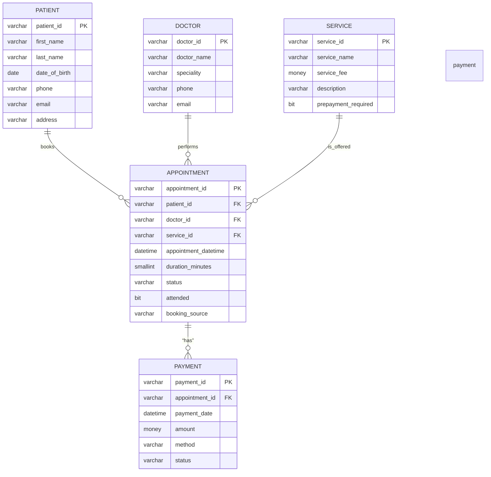

# Clinic-in-a-Day SQL Project

## Table of Contents  

– [Project Overview](#project-overview)  
– [Technology Stack](#technology-stack)  
– [Project Structure](#project-structure)  
– [Installation and Setup](#installation-and-setup)  
– [Features](#features)  
– [Model Implementation](#model-implementation)  
– [Controller & Scripts](#controller--scripts)  
– [Analytics Queries](#analytics-queries)  
– [Styling and Design](#styling-and-design)  
– [Entity-Relationship Diagram (ERD)](#entity-relationship-diagram-erd)  
– [Running the System](#running-the-system)  
– [Disclaimer](#disclaimer)  

## Project Overview  
This project implements a simplified clinic system for managing patients, doctors, services, appointments, and payments.  
The core logic is in `solutions.sql`, combining schema creation, data seeding, schema alterations, and analytical queries.

## Technology Stack  
- **Database**: Microsoft SQL Server (T-SQL)  
- **Tool**: SQL Server Management Studio or compatible SQL client  

## Project Structure  

```
clinic-in-a-day-sql/
├── solutions.sql     # SQL file containing schema, DML, analytics queries
└── README.md         # This documentation
```

## Installation and Setup  
1. Clone the repository:  
```bash
   git clone https://github.com/HChristopherNaoyuki/clinic-in-a-day-sql.git
```

2. Open `solutions.sql` in SSMS (or equivalent).
3. Run the script section by section: schema → seed data → alters → queries.

## Features

* Schema definitions with primary and foreign keys, constraints, default values
* At least two schema alterations (adding columns)
* Seeded data: 20+ patients, 5 doctors, 6 services, 25+ appointments, 15+ payments
* Queries demonstrating various JOIN types, aggregation, filters, and reporting

## Model Implementation

Entities in the system:

* **PATIENT**: stores patient personal data
* **DOCTOR**: stores doctor’s identity and specialization
* **SERVICE**: list of services the clinic offers
* **APPOINTMENT**: scheduled bookings linking patient, doctor, and service
* **PAYMENT**: payments made for appointments

## Controller & Scripts

The SQL file acts as controller by:

* Executing DDL statements (CREATE TABLE, ALTER)
* Executing DML statements (INSERT, UPDATE)
* Applying constraints, indexes, and defaults

## Analytics Queries

The script includes reporting queries such as:

* Completed appointments with patient/doctor/service details
* Appointment counts per doctor
* Payment summaries per appointment (balance, total paid)
* No-shows and cancellations
* Doctor availability snapshot for a given date
* Revenue per day
* Patients with outstanding balances

## Styling and Design

* SQL keywords uppercase
* Consistent indentation
* Section separators and comments indicating question or block
* Meaningful names for tables, columns, and constraints

## Entity-Relationship Diagram (ERD)



## Running the System

* Run the entire `solutions.sql` in your SQL environment.
* After execution, run the provided analytics queries to view results.
* You can extend or test with additional data by inserting new records.

## Disclaimer

This project is a demonstration and learning tool.
It does not include advanced production features like 
comprehensive concurrency control, full overlap checking 
for appointments, advanced security, or performance tuning.
Use it as a base and expand responsibly for real-world use.

---
